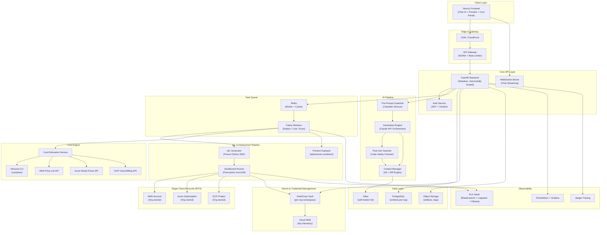
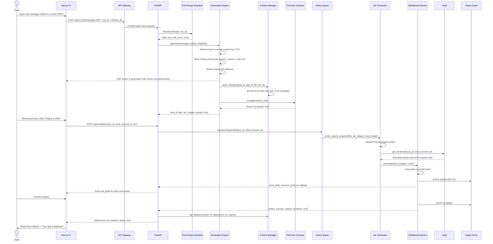
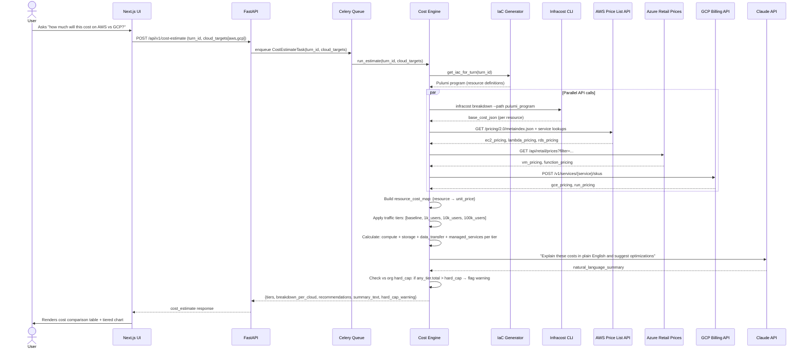
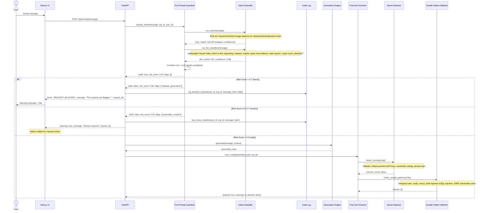
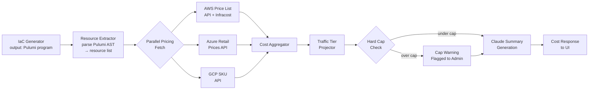

# Loomaris — Architecture Blueprint

> Self-orchestration SaaS platform: build, deploy, and manage applications through natural language chat, powered by Claude API, deployed to your own cloud infrastructure.

---

## Table of Contents

1. [High-Level System Architecture](#1-high-level-system-architecture)
2. [Sequence Diagrams](#2-sequence-diagrams)
3. [Tech Stack with Rationale](#3-tech-stack-with-rationale)
4. [Credential & Security Strategy](#4-credential--security-strategy)
5. [Pre-Flight Cost Engine Workflow](#5-pre-flight-cost-engine-workflow)
6. [Ethics Guardrails Implementation](#6-ethics-guardrails-implementation)
7. [Database Schema Patterns](#7-database-schema-patterns)
8. [API Schema Snippets](#8-api-schema-snippets)
9. [Implementation Phasing](#9-implementation-phasing)
10. [Risk Assessment & Mitigation](#10-risk-assessment--mitigation)
11. [Testing & Operations](#11-testing--operations)
12. [Next Steps Checklist](#12-next-steps-checklist)

---

## 1. High-Level System Architecture



### Component Responsibilities

| Component | Responsibility |
|---|---|
| Next.js Frontend | Chat UI, live preview iframe, cost preview panel, org/cloud account management |
| API Gateway (NGINX) | TLS termination, rate limiting (per-org token bucket), CORS, request routing |
| FastAPI Backend | REST + WebSocket, request validation, business logic orchestration, auth enforcement |
| Auth Service | JWT issuance, OAuth2 flows, org/user RBAC |
| Pre-Prompt Guardrail | Low-latency intent classification before Claude invocation |
| Generation Engine | Claude API orchestrator, context window manager, diff-based changeset builder |
| Post-Gen Scanner | Static analysis on generated code: secret detection, unsafe pattern matching |
| Context Manager | Git-backed state: each chat turn = one commit on org's app repo |
| IaC Generator | Renders Pulumi programs from Claude output; validates before execution |
| Sandboxed Runner | Firecracker microVM that executes Pulumi plan and apply in isolation |
| Cost Engine | Aggregates multi-cloud pricing, runs Infracost, produces tiered cost matrix |
| HashiCorp Vault | Per-org namespace, stores cloud credentials, Claude API keys, env vars |
| Cloud KMS | Master key encryption for Vault unseal keys and per-org data encryption |
| PostgreSQL | Multi-tenant schema-per-org: apps, sessions, deployments, audit logs |
| Gitea | Self-hosted Git for code versioning per generated app |
| Celery + Redis | Async task processing: deployments, cost estimation, scanning |

---

## 2. Sequence Diagrams

### 2a. Chat-to-Deployment Flow



### 2b. Cost Estimation Flow



### 2c. Ethics Guardrail Flow



---

## 3. Tech Stack with Rationale

| Layer | Technology | Rationale |
|---|---|---|
| Frontend | Next.js 14 (App Router, React 18) | SSR for SEO, React Server Components for performance, streaming support for chat UI |
| Frontend State | Zustand + React Query | Lightweight state; React Query handles async API state, caching, optimistic updates |
| Frontend Streaming | SSE (EventSource) + WebSocket | SSE for one-directional code streaming; WS for bidirectional chat state |
| UI Components | shadcn/ui + Tailwind CSS | Accessible, composable, zero-runtime styling |
| Code Editor | Monaco Editor (VS Code core) | Syntax highlighting for 30+ languages, diff view, inline annotation |
| Backend API | Python FastAPI | Async-native, auto OpenAPI schema, Pydantic validation; Python matches Anthropic SDK |
| Task Queue | Celery + Redis | Battle-tested async task execution; Redis as broker + result cache; retry + prioritization |
| AI Generation | Anthropic Claude API (claude-sonnet-4-6 / claude-opus-4-8) | Best-in-class code generation; streaming API; 200k context window for large codebases |
| Guardrail Classifier | Claude Haiku (claude-haiku-4-5) + rule engine | Haiku is low-latency and cheap for classification; rules catch obvious cases before LLM cost |
| Post-Gen Scanner | Semgrep + detect-secrets (Gitleaks) | Industry-standard SAST; Semgrep has pre-built rulesets for OWASP Top 10 + secrets |
| IaC | Pulumi (Python SDK) | Python-native (no HCL), programmatic generation, multi-cloud, state management, preview before apply |
| Runner Isolation | Firecracker microVM | Sub-second VM startup, hardware-level isolation, used in AWS Lambda; no container escape risk |
| Database | PostgreSQL 16 + pg_crypto | Schema-per-org tenant isolation, JSONB for flexible metadata, pg_crypto for column-level encryption |
| ORM | SQLAlchemy 2.0 (async) | Mature, async support, Alembic for migrations, supports schema-per-tenant routing |
| Git Backend | Gitea (self-hosted) | Lightweight, GitHub API-compatible, no external dependency, supports org/repo model |
| Secret Management | HashiCorp Vault (KV v2 + Transit) | Per-org namespace, encryption-as-a-service, dynamic cloud credentials, audit log |
| KMS | AWS KMS / Azure Key Vault (pluggable) | Hardware-backed root keys; Vault unseal keys wrapped with KMS; per-org DEKs |
| Container Orchestration | Kubernetes (EKS/GKE/AKS) | Horizontal scaling, rolling deploys, health checks, namespace isolation |
| Service Mesh | Istio | mTLS between services, traffic policies, circuit breakers, telemetry |
| Object Storage | S3-compatible (MinIO for dev, S3 for prod) | Artifact storage: IaC bundles, deployment logs, code snapshots |
| Metrics | Prometheus + Grafana | Standard Kubernetes monitoring; custom metrics for generation latency, deploy success rate |
| Tracing | Jaeger (OpenTelemetry) | Distributed traces across FastAPI + Celery + Generation Engine |
| Logging | ELK (Elasticsearch + Logstash + Kibana) | Structured log aggregation; separate index per org for tenant log isolation |
| Cost Engine | Infracost + custom aggregator | Infracost parses Pulumi plans into cost; custom layer adds traffic-tier projections |
| Auth | JWT (short-lived) + OAuth2 (Google) | Phase 1: internal JWT; Phase 2: Google OAuth per org; PKCE flow for SPA |
| CDN | CloudFront / Cloudflare | Edge caching for static assets; DDoS protection; geographic distribution |
| API Gateway | NGINX + Lua middleware | Rate limiting per org (token bucket), CORS, JWT validation at edge |

---

## 4. Credential & Security Strategy

### 4a. KMS Key Hierarchy

```
Root KMS Key (AWS KMS / HSM-backed)
├── Vault Unseal Key (encrypted by Root KMS)
├── Platform DEK (Data Encryption Key)
│   ├── PG column encryption (pg_crypto) for PII
│   └── S3 server-side encryption for artifacts
└── Per-Org KMS Key (derived per org_id)
    ├── Org DEK → encrypts org's cloud credentials at rest
    ├── Vault Transit Key (per-org namespace) → encrypts Vault secrets
    └── Gitea repo encryption key (per-org repos)
```

### 4b. Per-Org Vault Namespace Structure

```
vault/
├── sys/policies/org_{org_id}_policy
├── org_{org_id}/
│   ├── kv/
│   │   ├── cloud_credentials/
│   │   │   ├── aws_{account_id}         # IAM role ARN + external ID
│   │   │   ├── azure_{subscription_id}  # Service Principal client_id + client_secret
│   │   │   └── gcp_{project_id}         # Service Account JSON (encrypted)
│   │   ├── llm_keys/
│   │   │   └── claude_api_key           # Phase 2: per-org key
│   │   └── app_secrets/
│   │       └── {app_id}/
│   │           ├── env_{env_name}       # App env vars
│   │           └── ssl_cert             # Custom domain TLS cert
│   └── transit/
│       └── org_{org_id}_key             # Transit encryption engine per org
```

### 4c. Short-Lived Cloud Credentials Pattern

```python
class CredentialBroker:
    def get_aws_credentials(self, org_id: str, cloud_account_id: str) -> AWSCredentials:
        # 1. Fetch IAM role ARN from Vault
        vault_path = f"org_{org_id}/kv/cloud_credentials/aws_{cloud_account_id}"
        role_config = vault.read(vault_path)

        # 2. Assume role with STS — short-lived 15-minute token
        sts = boto3.client("sts")
        response = sts.assume_role(
            RoleArn=role_config["role_arn"],
            RoleSessionName=f"loomaris-deploy-{uuid4()}",
            ExternalId=role_config["external_id"],  # prevents confused deputy attack
            DurationSeconds=900,
            Policy=MINIMAL_DEPLOY_POLICY_JSON       # least-privilege scoping
        )
        return AWSCredentials(
            access_key=response["Credentials"]["AccessKeyId"],
            secret_key=response["Credentials"]["SecretAccessKey"],
            session_token=response["Credentials"]["SessionToken"],
            expiry=response["Credentials"]["Expiration"]
        )

    def get_azure_credentials(self, org_id: str, cloud_account_id: str) -> AzureToken:
        # MSAL: client_credentials flow → short-lived access token (1hr)
        ...

    def get_gcp_credentials(self, org_id: str, cloud_account_id: str) -> GCPToken:
        # Service Account → short-lived access_token
        ...
```

### 4d. Firecracker Runner Security Boundary

```
Kubernetes Pod (Celery Worker)
└── Firecracker Host Process
    └── microVM Guest (per deployment task)
        ├── Minimal Linux guest kernel (5MB)
        ├── Pulumi Python runtime
        ├── Cloud credentials injected via virtio serial (NOT env vars)
        ├── NO internet access except target cloud endpoints (egress firewall)
        ├── NO access to host filesystem (vsock for result callback only)
        └── Destroyed immediately after task completion
```

Key isolation properties:
- Each deployment gets a fresh microVM; no state persists between tasks
- Cloud credentials injected via in-guest secret mount, never in process environment
- Egress restricted via iptables to only the target cloud's IP ranges
- Pulumi state backend is a per-org S3 bucket (not local); microVM has no persistent state

### 4e. Runner Callback Authentication

```python
# Before launching runner — one-time callback token
callback_token = secrets.token_urlsafe(32)
redis.setex(f"runner_callback:{task_id}", 900, callback_token)

# Runner POSTs result to internal API endpoint:
# POST /internal/runner-callback/{task_id}
# Header: X-Runner-Token: <callback_token>
# Token is invalidated immediately after first use
```

### 4f. Rotation Policies

| Secret Type | TTL / Rotation | Method |
|---|---|---|
| AWS STS tokens | 15 min (auto) | STS AssumeRole re-called per task |
| Azure access tokens | 1 hr (auto) | MSAL re-auth per task |
| Vault root tokens | Never stored | AppRole auth; secret_id rotated every 24hr |
| Claude API key (master) | Quarterly (manual) | Vault lease renewal + admin notification |
| Per-org Claude keys (Phase 2) | Org-managed | Org admin rotates via UI; old key revoked |
| DB passwords | Per-session | Vault PostgreSQL dynamic secrets engine |
| JWT signing keys | 30-day automatic | Key ID in header; 2-key window for zero-downtime rotation |

---

## 5. Pre-Flight Cost Engine Workflow

### 5a. Architecture



### 5b. Pydantic Models

```python
class TierEstimate(BaseModel):
    tier_label: str             # "1k users/month"
    monthly_cost: Decimal
    breakdown: dict[str, Decimal]   # {"compute": 45.20, "storage": 12.10, ...}
    assumptions: list[str]

class TierCostMatrix(BaseModel):
    org_id: str
    app_id: str
    turn_id: str
    generated_at: datetime
    currency: str = "USD"
    tiers: dict[str, TierEstimate]  # keys: "baseline", "1k", "10k", "100k"
    cloud_comparison: dict[str, Any]  # keys: "aws", "azure", "gcp"
    hard_cap: Decimal
    hard_cap_exceeded_at_tier: str | None
    summary_text: str
    recommendations: list[str]
```

### 5c. Traffic Tier Projection Model

| Traffic Tier | Compute Factor | Storage Factor | Data Transfer | Managed Services |
|---|---|---|---|---|
| Baseline (dev) | 1× (min config) | 1× | minimal | smallest tier |
| 1k users/month | ~2× | 1.5× | 50 GB/mo | small tier |
| 10k users/month | ~5× | 3× | 500 GB/mo | medium tier |
| 100k users/month | ~20× | 10× | 5 TB/mo | large / auto-scale |

Serverless resources (Lambda, Cloud Run) are calculated per-invocation with assumed p50 duration and memory. VMs use reserved vs on-demand pricing comparison per tier.

### 5d. Hard Cap Enforcement

```python
class CostCapEnforcer:
    def check_and_enforce(
        self,
        org_id: str,
        cost_matrix: TierCostMatrix,
        deployment_target_tier: str
    ) -> CostCapResult:
        org_config = db.get_org_config(org_id)
        hard_cap = org_config.cost_hard_cap_usd_monthly
        target_cost = cost_matrix.tiers[deployment_target_tier].monthly_cost

        if target_cost > hard_cap:
            audit_log.warn(org_id=org_id, event="COST_CAP_EXCEEDED",
                           estimated=target_cost, cap=hard_cap)
            return CostCapResult(
                allowed=False,
                reason=f"Estimated cost ${target_cost} exceeds org cap ${hard_cap}",
                suggested_action="resize_resources_or_increase_cap"
            )

        if target_cost > hard_cap * Decimal("0.8"):
            notification_service.send_admin_warning(org_id, target_cost, hard_cap)

        return CostCapResult(allowed=True)
```

---

## 6. Ethics Guardrails Implementation

### 6a. Pre-Prompt Classifier Design

Two-layer approach — fast rules first, LLM fallback only when needed.

**Layer 1 — Rule Engine (< 1ms):**

```python
BLOCKLIST_PATTERNS = [
    # Malware / exploits
    (r"\b(keylogger|rootkit|ransomware|botnet|C2 server|command.and.control)\b", "malware"),
    (r"\b(exploit|CVE-\d{4}|zero.?day|privilege.?escalat)\b", "exploit"),
    # Spam / phishing
    (r"\b(mass.?email|bulk.?SMS|phishing|credential.?harvest)\b", "phishing"),
    # Surveillance
    (r"\b(stalk|spy.?on|track.?location.?without|hidden.?camera)\b", "surveillance"),
    # Crypto scams
    (r"\b(rug.?pull|fake.?token|pump.?and.?dump|honeypot.?contract)\b", "crypto_scam"),
    # Hate speech
    (r"\b(generate.+hate|write.+slur|create.+propaganda)\b", "hate_speech"),
]

def rule_classify(message: str) -> ClassificationResult:
    for pattern, category in BLOCKLIST_PATTERNS:
        if re.search(pattern, message, re.IGNORECASE):
            return ClassificationResult(flagged=True, category=category, method="rule")
    return ClassificationResult(flagged=False, method="rule")
```

**Layer 2 — LLM Classifier (< 200ms, called only if rules pass):**

```python
CLASSIFIER_SYSTEM_PROMPT = """
You are a safety classifier for a code generation platform.
Determine if the user's request is asking to build something harmful.

Categories to block (respond BLOCK + category):
- MALWARE: malware, spyware, ransomware, botnets, keyloggers, rootkits
- EXPLOIT: tools to exploit CVEs, bypass security, escalate privileges
- PHISHING: phishing sites, credential harvesters, scam landing pages
- SPAM: spam bots, bulk unsolicited message senders
- SURVEILLANCE: stalkerware, covert location tracking, hidden monitoring
- HATE: hate speech generators, targeted harassment tools
- SCAM: crypto rug pulls, fake investment platforms, Ponzi structures

If clearly benign: ALLOW
If ambiguous but concerning: REVIEW
Format: DECISION|CATEGORY|CONFIDENCE(0-1)|BRIEF_REASON
"""

async def llm_classify(message: str) -> ClassificationResult:
    response = await anthropic_client.messages.create(
        model="claude-haiku-4-5-20251001",
        max_tokens=100,
        system=CLASSIFIER_SYSTEM_PROMPT,
        messages=[{"role": "user", "content": message}]
    )
    return parse_classifier_response(response.content[0].text)
```

**Combined decision logic:**

```python
async def classify_message(message: str, org_id: str) -> GuardrailDecision:
    rule_result = rule_classify(message)
    if rule_result.flagged and rule_result.confidence > 0.9:
        return GuardrailDecision(action="BLOCK", source="rule", ...)

    llm_result = await llm_classify(message)

    if llm_result.decision == "BLOCK" and llm_result.confidence > 0.7:
        return GuardrailDecision(action="BLOCK", source="llm", ...)
    elif llm_result.decision == "REVIEW" or (rule_result.flagged and llm_result.decision == "ALLOW"):
        return GuardrailDecision(action="REVIEW", source="combined", ...)
    else:
        return GuardrailDecision(action="ALLOW", ...)
```

### 6b. Post-Generation Code Scanner

```python
class CodeScanner:
    def __init__(self):
        self.semgrep_rules = [
            "p/owasp-top-ten",
            "p/secrets",
            "p/python",
            "p/javascript",
            "loomaris/custom-rules",
        ]

    async def scan(self, code_files: dict[str, str], org_id: str) -> ScanResult:
        issues = []
        issues.extend(self._run_detect_secrets(code_files))
        issues.extend(await self._run_semgrep(code_files))
        issues.extend(self._check_iac_safety(code_files))
        critical = [i for i in issues if i.severity == "critical"]
        return ScanResult(passed=len(critical) == 0, issues=issues, blocked=len(critical) > 0)
```

**Custom Semgrep rules (`loomaris/custom-rules.yaml`):**

```yaml
rules:
  - id: hardcoded-aws-key
    pattern: $VAR = "AKIA..."
    message: Hardcoded AWS Access Key ID detected
    severity: ERROR
    languages: [python, javascript, typescript]

  - id: iac-public-s3-bucket
    pattern: |
      aws.s3.BucketAcl(..., acl="public-read", ...)
    message: S3 bucket with public-read ACL — data exposure risk
    severity: WARNING
    languages: [python]

  - id: iac-unrestricted-ssh
    pattern: |
      aws.ec2.SecurityGroupRule(..., cidr_blocks=["0.0.0.0/0"], from_port=22, ...)
    message: SSH open to the internet — restrict to known IPs
    severity: ERROR
    languages: [python]
```

---

## 7. Database Schema Patterns

### 7a. Tenant Isolation Strategy

```sql
-- Platform-wide metadata (shared)
CREATE SCHEMA IF NOT EXISTS platform;

-- Per-org schema, created on org registration
-- Pattern: org_{org_id} (e.g. org_abc123)
CREATE SCHEMA IF NOT EXISTS org_abc123;
```

### 7b. Platform Schema

```sql
CREATE TABLE platform.organizations (
    id              UUID PRIMARY KEY DEFAULT gen_random_uuid(),
    name            VARCHAR(255) NOT NULL,
    slug            VARCHAR(100) UNIQUE NOT NULL,
    plan            VARCHAR(50) NOT NULL DEFAULT 'trial',
    cost_hard_cap   DECIMAL(12,2) NOT NULL DEFAULT 500.00,
    created_at      TIMESTAMPTZ NOT NULL DEFAULT NOW(),
    suspended_at    TIMESTAMPTZ,
    metadata        JSONB NOT NULL DEFAULT '{}'
);

CREATE TABLE platform.users (
    id              UUID PRIMARY KEY DEFAULT gen_random_uuid(),
    email           VARCHAR(255) UNIQUE NOT NULL,
    name            VARCHAR(255),
    google_sub      VARCHAR(255) UNIQUE,  -- Phase 2: Google OAuth subject
    created_at      TIMESTAMPTZ NOT NULL DEFAULT NOW(),
    last_login_at   TIMESTAMPTZ
);

CREATE TABLE platform.org_memberships (
    org_id          UUID REFERENCES platform.organizations(id) ON DELETE CASCADE,
    user_id         UUID REFERENCES platform.users(id) ON DELETE CASCADE,
    role            VARCHAR(50) NOT NULL DEFAULT 'member',  -- owner, admin, member
    joined_at       TIMESTAMPTZ NOT NULL DEFAULT NOW(),
    PRIMARY KEY (org_id, user_id)
);

CREATE TABLE platform.cloud_accounts (
    id              UUID PRIMARY KEY DEFAULT gen_random_uuid(),
    org_id          UUID NOT NULL REFERENCES platform.organizations(id),
    provider        VARCHAR(20) NOT NULL,   -- aws, azure, gcp
    display_name    VARCHAR(255) NOT NULL,
    external_id     VARCHAR(255) NOT NULL,  -- AWS account ID / Azure sub ID / GCP project
    vault_path      VARCHAR(500) NOT NULL,  -- path in Vault where creds are stored
    status          VARCHAR(50) NOT NULL DEFAULT 'pending_verification',
    last_verified_at TIMESTAMPTZ,
    created_at      TIMESTAMPTZ NOT NULL DEFAULT NOW()
);
```

### 7c. Per-Org Schema (instantiated per organization)

```sql
-- Template — instantiated as org_{org_id}.{table}

CREATE TABLE apps (
    id              UUID PRIMARY KEY DEFAULT gen_random_uuid(),
    name            VARCHAR(255) NOT NULL,
    slug            VARCHAR(100) NOT NULL,
    app_type        VARCHAR(50) NOT NULL,   -- web, api, worker, mobile_backend, static
    git_repo_url    VARCHAR(500),
    created_at      TIMESTAMPTZ NOT NULL DEFAULT NOW(),
    archived_at     TIMESTAMPTZ,
    metadata        JSONB NOT NULL DEFAULT '{}'
);

CREATE TABLE chat_sessions (
    id              UUID PRIMARY KEY DEFAULT gen_random_uuid(),
    app_id          UUID REFERENCES apps(id),
    title           VARCHAR(255),
    created_by      UUID NOT NULL,
    created_at      TIMESTAMPTZ NOT NULL DEFAULT NOW(),
    last_active_at  TIMESTAMPTZ NOT NULL DEFAULT NOW()
);

CREATE TABLE chat_turns (
    id              UUID PRIMARY KEY DEFAULT gen_random_uuid(),
    session_id      UUID NOT NULL REFERENCES chat_sessions(id),
    turn_index      INTEGER NOT NULL,
    role            VARCHAR(20) NOT NULL,   -- user, assistant
    content         TEXT NOT NULL,
    git_commit_sha  VARCHAR(40),            -- commit SHA if assistant turn generated code
    token_count     INTEGER,
    created_at      TIMESTAMPTZ NOT NULL DEFAULT NOW()
);

CREATE TABLE deployments (
    id              UUID PRIMARY KEY DEFAULT gen_random_uuid(),
    app_id          UUID NOT NULL REFERENCES apps(id),
    turn_id         UUID REFERENCES chat_turns(id),
    cloud_account_id UUID NOT NULL,
    environment     VARCHAR(50) NOT NULL,   -- preview, staging, production
    status          VARCHAR(50) NOT NULL DEFAULT 'pending',
    pulumi_stack_id VARCHAR(255),
    outputs         JSONB,                  -- {endpoint, arn, ip, ...}
    cost_snapshot   JSONB,                  -- cost estimate at deploy time
    deployed_at     TIMESTAMPTZ,
    destroyed_at    TIMESTAMPTZ,
    created_at      TIMESTAMPTZ NOT NULL DEFAULT NOW()
);

CREATE TABLE cost_estimates (
    id              UUID PRIMARY KEY DEFAULT gen_random_uuid(),
    app_id          UUID NOT NULL REFERENCES apps(id),
    turn_id         UUID,
    cloud_provider  VARCHAR(20),
    tier_matrix     JSONB NOT NULL,
    created_at      TIMESTAMPTZ NOT NULL DEFAULT NOW()
);

CREATE TABLE audit_log (
    id              BIGSERIAL PRIMARY KEY,
    event_type      VARCHAR(100) NOT NULL,
    user_id         UUID,
    resource_type   VARCHAR(50),
    resource_id     UUID,
    details         JSONB,
    ip_address      INET,
    created_at      TIMESTAMPTZ NOT NULL DEFAULT NOW()
);
CREATE INDEX ON audit_log (event_type, created_at DESC);
```

### 7d. SQLAlchemy Tenant Router

```python
from sqlalchemy import event, text
from sqlalchemy.orm import Session

class TenantSessionFactory:
    def get_session(self, org_id: str) -> Session:
        session = async_session_factory()

        @event.listens_for(session, "after_begin")
        def set_search_path(session, transaction, connection):
            connection.execute(
                text(f"SET search_path TO org_{org_id}, platform, public")
            )

        return session
```

---

## 8. API Schema Snippets

### 8a. Chat Message

```python
# POST /api/v1/chat/message
class ChatMessageRequest(BaseModel):
    session_id: UUID
    message: str = Field(max_length=10000)
    attachments: list[FileAttachment] = []

class ChatMessageResponse(BaseModel):
    turn_id: UUID
    session_id: UUID
    status: Literal["streaming", "complete", "blocked", "error"]
    stream_url: str | None         # SSE endpoint for streaming response
    generated_files: list[GeneratedFile] | None
    preview_url: str | None
    git_commit_sha: str | None
    guardrail_warning: str | None  # populated if status="blocked"

class GeneratedFile(BaseModel):
    path: str           # e.g. "src/app/page.tsx"
    content: str
    language: str
    is_iac: bool = False

# SSE event shapes:
# event: code_chunk  →  {"file_path": "src/app/page.tsx", "chunk": "import React...", "done": false}
# event: turn_complete  →  {"turn_id": "...", "git_commit_sha": "abc123", "preview_url": "https://..."}
```

### 8b. Deploy

```python
# POST /api/v1/deploy
class DeployRequest(BaseModel):
    app_id: UUID
    turn_id: UUID
    cloud_account_id: UUID
    environment: Literal["preview", "staging", "production"]
    env_vars: dict[str, str] = {}
    custom_domain: str | None = None
    confirm_cost: bool = False  # must be True if cost was shown

class DeployResponse(BaseModel):
    deployment_id: UUID
    status: Literal["queued", "running", "success", "failed"]
    task_id: str
    estimated_duration_seconds: int
    cost_snapshot: TierCostMatrix | None

# GET /api/v1/deploy/{deployment_id}/status
class DeployStatusResponse(BaseModel):
    deployment_id: UUID
    status: Literal["queued", "planning", "applying", "success", "failed", "rolling_back"]
    progress_steps: list[DeployStep]
    outputs: DeployOutputs | None
    error: str | None

class DeployOutputs(BaseModel):
    endpoint: str | None
    api_url: str | None
    cdn_url: str | None
    resource_ids: dict[str, str]
    logs_url: str | None
```

### 8c. Cost Estimate

```python
# POST /api/v1/cost-estimate
class CostEstimateRequest(BaseModel):
    app_id: UUID
    turn_id: UUID
    cloud_providers: list[Literal["aws", "azure", "gcp"]] = ["aws"]
    region_preferences: dict[str, str] = {}  # {"aws": "us-east-1"}

class CostEstimateResponse(BaseModel):
    estimate_id: UUID
    status: Literal["computing", "complete", "error"]
    task_id: str
    tier_matrix: TierCostMatrix | None
    summary_text: str | None
    recommendations: list[str]
    hard_cap_warning: bool
    hard_cap_exceeded_tier: str | None  # e.g. "10k_users"
```

### 8d. Rollback & Export

```python
# POST /api/v1/rollback
class RollbackRequest(BaseModel):
    app_id: UUID
    deployment_id: UUID | None = None  # rollback to specific deployment
    turn_id: UUID | None = None        # rollback to specific git commit

class RollbackResponse(BaseModel):
    new_deployment_id: UUID
    rolled_back_from: str
    rolled_back_to: str
    status: Literal["queued", "running"]
    task_id: str

# POST /api/v1/apps/{app_id}/export
class ExportResponse(BaseModel):
    export_id: UUID
    download_url: str       # signed S3 URL, 1hr TTL
    expires_at: datetime
    contents: list[str]     # ["source_code/", "iac/pulumi/", "iac/terraform/", "README.md"]
    size_bytes: int
```

### 8e. Cloud Account Registration

```python
# POST /api/v1/cloud-accounts
class CloudAccountRegisterRequest(BaseModel):
    provider: Literal["aws", "azure", "gcp"]
    display_name: str
    # AWS
    role_arn: str | None = None
    external_id: str | None = None     # generated by platform, used in trust policy
    # Azure
    tenant_id: str | None = None
    client_id: str | None = None
    client_secret: str | None = None   # stored in Vault, never in DB
    subscription_id: str | None = None
    # GCP
    service_account_json: str | None = None  # stored in Vault, never in DB
    project_id: str | None = None

class CloudAccountRegisterResponse(BaseModel):
    cloud_account_id: UUID
    status: Literal["pending_verification", "verified", "failed"]
    verification_task_id: str
    aws_trust_policy_snippet: dict | None  # IAM policy snippet for AWS setup
```

---

## 9. Implementation Phasing

### Phase 1: MVP (Weeks 1–10)

**Goal:** Single org, AWS only, master Claude key, file-diff state, basic cost estimate.

**Scope:**
- Single hardcoded org (no multi-tenancy yet)
- AWS only via IAM role assumption
- Chat → code generation (streaming) → live preview (Docker container in K8s)
- Deployment targets: S3 + CloudFront (static sites), ECS Fargate (APIs)
- Git-backed state: each turn = git commit to Gitea repo; diff view in UI
- Basic cost estimate: AWS compute + storage only (no tiered projection yet)
- Single master Claude API key in Vault (not env vars)
- JWT auth (email + password; no OAuth)
- Rule-based guardrail only (no LLM classifier yet)
- detect-secrets post-gen scanner
- ELK logging only

**Project Layout:**

```
loomaris/
├── frontend/                    # Next.js app
│   ├── app/
│   │   ├── chat/               # Chat interface + code viewer
│   │   └── preview/            # App preview iframe
│   └── components/
├── backend/
│   ├── api/                    # FastAPI app
│   │   ├── routes/
│   │   │   ├── chat.py
│   │   │   ├── deploy.py
│   │   │   └── cost.py
│   │   ├── models/             # SQLAlchemy models
│   │   ├── services/
│   │   │   ├── generation.py   # Claude API orchestrator
│   │   │   ├── context.py      # Git-backed context manager
│   │   │   ├── guardrail.py    # Rule-based pre-prompt filter
│   │   │   └── scanner.py      # Post-gen code scanner
│   │   └── main.py
│   ├── workers/                # Celery tasks
│   │   ├── deploy_task.py
│   │   └── cost_task.py
│   └── iac/
│       ├── generator.py        # Pulumi program generator
│       └── runner.py           # Execution (Docker-based for Phase 1)
├── infrastructure/
│   ├── k8s/
│   └── docker-compose.dev.yml
└── db/
    └── migrations/             # Alembic migrations
```

**Phase 1 Milestones:**

| Week | Milestone |
|---|---|
| 1–2 | Project scaffold, DB schema, auth, basic FastAPI routes |
| 3–4 | Claude API integration, streaming chat, Git context manager |
| 5–6 | Pulumi AWS generator (S3+CF static, ECS Fargate API) |
| 7 | Basic cost estimate (AWS compute + storage via boto3 pricing) |
| 8 | Rule-based guardrail + post-gen scanner (detect-secrets) |
| 9 | Preview deployment (Docker Compose in K8s) |
| 10 | E2E testing, bug fixes, internal demo |

---

### Phase 2: Multi-Tenant + BYO-Cloud (Weeks 11–22)

**New capabilities:**
- Schema-per-org tenant isolation in PostgreSQL
- Google OAuth (per-org SSO configuration)
- Per-org Vault namespaces + KMS key hierarchy
- Cloud account registration (AWS + Azure + GCP) with Vault credential storage
- Firecracker-based sandboxed runners (replaces Docker runners)
- Multi-cloud Pulumi programs: AWS Lambda, Azure Functions, GCP Cloud Run
- Full tiered cost illustration (4 tiers × multi-cloud comparison)
- LLM-based guardrail classifier (Claude Haiku) alongside rules
- Semgrep SAST integration in post-gen scanner
- Hard cap enforcement per org
- Prometheus + Grafana metrics
- Live preview via ephemeral K8s deployments
- Rollback: chat-triggered `git checkout` + redeploy
- Code + IaC export endpoint

**Phase 2 additions:**

```
backend/
├── services/
│   ├── tenant_manager.py      # Schema provisioning per org
│   ├── vault_client.py        # Vault integration
│   ├── credential_broker.py   # Short-lived cloud cred fetching
│   └── cost_engine/
│       ├── aggregator.py
│       ├── aws_pricing.py
│       ├── azure_pricing.py
│       ├── gcp_pricing.py
│       └── tier_projector.py
├── workers/
│   └── firecracker_runner.py  # Firecracker VM orchestration
infrastructure/
├── vault/
│   ├── policies/
│   └── config/
└── firecracker/
    ├── guest-kernel/
    └── rootfs/
```

---

### Phase 3: Enterprise (Weeks 23–36)

**New capabilities:**
- Per-org Claude API key stored in Vault, used instead of master key
- AST-aware code storage: tree-sitter AST nodes in DB; surgical edits and intelligent diffs
- Agent-based deployment: Claude with tool calls (plan → review → apply loop)
- SAML/OIDC enterprise SSO (Okta, Azure AD)
- Advanced RBAC: custom roles per org, resource-level permissions
- Human review queue for REVIEW-flagged guardrail decisions
- Fine-tuned guardrail classifier on Loomaris-specific abuse patterns
- Stripe billing: platform subscription + usage-based metering per org
- Compliance: audit log export, data residency controls, GDPR data deletion
- Multi-region platform deployment
- SOC 2 Type II readiness

---

## 10. Risk Assessment & Mitigation

### Risk 1: LLM Context Exhaustion

**Problem:** As chat sessions grow, accumulated code + history exceeds Claude's context window. Even with 200k tokens, large apps with many files + long history hit limits.

**Impact:** Degraded generation quality, truncated context, incorrect edits to large codebases.

**Mitigations:**
1. **Sliding window + summarisation** — Summarize older turns: `"Summarize what was built so far in 500 words"`. Include summary instead of full history.
2. **Git diff context** — Send only the diff from last N turns rather than full file contents. Reconstruct full files only when explicitly needed.
3. **File-targeted prompting** — Retrieve only files relevant to the current edit (embeddings-based retrieval or explicit file mention).
4. **Context budget tracker** — Track token count per turn; warn user and suggest "start new session" when approaching 80% of context window.
5. **AST chunking (Phase 3)** — Send only AST subtrees relevant to the current edit.

```python
class ContextManager:
    MAX_CONTEXT_TOKENS = 160_000  # leave buffer below 200k

    def build_context(self, session_id: UUID, new_message: str) -> list[dict]:
        turns = db.get_recent_turns(session_id, limit=50)
        token_budget = self.MAX_CONTEXT_TOKENS - count_tokens(new_message)

        context_messages = []
        for turn in reversed(turns):
            turn_tokens = count_tokens(turn.content)
            if token_budget - turn_tokens < 20_000:  # reserve 20k for response
                summary = self._summarize_older_turns(session_id, up_to=turn.id)
                context_messages.insert(0, {"role": "user", "content": f"[Context summary: {summary}]"})
                break
            context_messages.insert(0, {"role": turn.role, "content": turn.content})
            token_budget -= turn_tokens

        return context_messages
```

---

### Risk 2: IaC Generation Errors

**Problem:** Claude-generated Pulumi programs may have syntax errors, invalid resource configs, or security misconfigurations.

**Impact:** Deployment failures, wasted compute, potential security exposure (public S3 buckets, open security groups).

**Mitigations:**
1. **Pulumi preview gate** — Always run `pulumi preview` before `pulumi up`; diff shown to user before apply.
2. **IaC validation layer** — Parse Pulumi Python with `ast.parse()` before execution; catch syntax errors immediately.
3. **Semgrep IaC rules** — Custom rules for common IaC misconfigurations (see §6b).
4. **Resource allowlist per plan** — Trial plan cannot create EC2 > t3.medium; restrict resource types by plan tier.
5. **Iterative correction loop** — If `pulumi preview` fails, feed error back to Claude: `"Fix this Pulumi error: {error}"`. Max 3 retries.
6. **Golden templates** — Pre-validated Pulumi component library (VPC, ECS service, RDS) that Claude assembles rather than generates from scratch.

```python
class IaCValidator:
    ALLOWED_RESOURCES_BY_PLAN = {
        "trial":   ["aws.s3", "aws.cloudfront", "aws.lambda_", "aws.apigateway"],
        "starter": ["aws.s3", "aws.cloudfront", "aws.lambda_", "aws.ecs", "aws.rds"],
        "pro":     ["*"],
    }

    def validate(self, pulumi_program: str, org_plan: str) -> ValidationResult:
        try:
            ast.parse(pulumi_program)
        except SyntaxError as e:
            return ValidationResult(valid=False, error=f"Syntax error: {e}")

        used_resources = self._extract_resource_types(pulumi_program)
        allowed = self.ALLOWED_RESOURCES_BY_PLAN.get(org_plan, [])
        if "*" not in allowed:
            blocked = [r for r in used_resources if not any(r.startswith(a) for a in allowed)]
            if blocked:
                return ValidationResult(valid=False, error=f"Resources not allowed on {org_plan}: {blocked}")

        semgrep_result = run_semgrep(pulumi_program, rules=["loomaris/iac-security"])
        critical = [i for i in semgrep_result.findings if i.severity == "ERROR"]
        if critical:
            return ValidationResult(valid=False, security_issues=critical)

        return ValidationResult(valid=True)
```

---

### Risk 3: Credential Leakage

**Problem:** Cloud credentials stored or transmitted insecurely could be exfiltrated.

**Impact:** Complete cloud account compromise; data breach; financial damage.

**Mitigations:**
1. **Credentials never in DB** — Only Vault path references stored in `platform.cloud_accounts`.
2. **Short-lived tokens only** — STS AssumeRole (15 min TTL) for all AWS ops.
3. **Vault Transit encryption** — Encrypts/decrypts credentials; Vault never stores plaintext GCP service account JSON.
4. **KMS-encrypted Vault** — Vault unseal keys are KMS-encrypted; KMS requires cloud IAM auth.
5. **Audit log on every access** — Vault audit log + platform audit log; alerts on anomalies.
6. **Post-gen scanner** — Prevent Claude from accidentally echoing credentials in generated code.
7. **microVM credential injection** — Injected via virtio serial device (not env vars, not files); wiped on task completion.
8. **Network egress restriction** — Firecracker VMs can only reach target cloud endpoints.

---

### Risk 4: Cost Explosion

**Problem:** A user deploys an app that creates expensive cloud resources, incurring large unexpected bills.

**Impact:** Financial loss; reputational damage; platform abuse.

**Mitigations:**
1. **Hard cap enforcement** — Pre-deployment cap check; deployment blocked if estimate exceeds org cap.
2. **Pulumi preview cost gate** — Show cost delta before every `pulumi up`; require explicit confirmation.
3. **Resource limits per plan** — Trial: no EC2, no RDS; hard limits on resource counts.
4. **Cloud-side safeguards** — Loomaris onboarding IAM policy has explicit `Deny` on expensive resource types for lower-tier plans.
5. **Post-deployment monitoring** — Alert if actual cloud spend (via Cost Explorer API) significantly exceeds estimate.
6. **Automatic destroy on inactivity** — Preview environments auto-destroyed after 24 hours.

---

### Risk 5: Tenant Data Isolation Failure

**Problem:** A bug in schema routing causes one org's data to be readable by another.

**Impact:** Data breach across tenants; catastrophic trust failure.

**Mitigations:**
1. **Schema-per-org + search_path routing** — Each DB connection sets `search_path = org_{org_id}, platform, public` immediately after creation.
2. **Row-level security as backup** — PostgreSQL RLS policies on critical tables as a second isolation layer.
3. **Cross-org integration tests** — Automated tests verify org A's session cannot read org B's data even with crafted queries.
4. **DB user per org (Phase 3)** — Each org gets a distinct PostgreSQL user with GRANT only on their schema.

---

## 11. Testing & Operations

### 11a. Testing Strategy

**Unit Tests:**
- Generation Engine: mock Anthropic client; verify context building, streaming parsing, error handling
- Cost Engine: mock pricing APIs with fixtures; verify tier calculations and cap logic
- IaC Validator: assert syntax errors, resource blocklist, Semgrep findings are caught
- Guardrail classifier: verify blocklist patterns, mock Haiku responses, test decision logic

**Integration Tests:**
- Full chat → generate → preview flow against test Gitea instance
- Vault integration: credential storage, retrieval, Transit encryption
- PostgreSQL: multi-org schema isolation test (cross-org query attempts must fail)
- Celery task flows: mock cloud APIs; verify task state transitions

**Mock Cloud API Pattern:**

```python
# tests/mocks/aws_mock.py
import responses

@responses.activate
def test_deploy_to_aws(client, mock_org, mock_cloud_account):
    responses.add(responses.POST, "https://sts.amazonaws.com/",
                  json=STS_ASSUME_ROLE_RESPONSE, status=200)
    responses.add(responses.GET, "https://s3.amazonaws.com/...", ...)
    responses.add(responses.PUT, "https://s3.amazonaws.com/...", ...)
    responses.add(responses.POST, "https://ecs.us-east-1.amazonaws.com/...", ...)

    response = client.post("/api/v1/deploy", json={...})
    assert response.status_code == 202
    assert response.json()["status"] == "queued"
```

**End-to-End Tests (Playwright):**
- User registers → creates org → connects AWS test account → sends chat message → deploys → sees endpoint
- Cost estimate flow: generates tiered matrix with mocked pricing APIs
- Guardrail: sends blocked prompt → receives warning → no code generated

**Load Testing (k6):**
- 100 concurrent chat sessions; verify API response times < 200ms (excluding streaming)
- 50 concurrent deploy tasks; verify Celery queue doesn't back up

### 11b. K8s Deployment Topology

```yaml
# Loomaris platform — high-level K8s topology

Namespace: loomaris-platform
  Deployments:
    - frontend (Next.js)          replicas: 3
    - api (FastAPI)               replicas: 5, HPA (CPU > 60%)
    - guardrail-service           replicas: 3, HPA (CPU > 50%)
    - celery-deploy-workers       replicas: 5, KEDA (queue depth)
    - celery-cost-workers         replicas: 3, KEDA
    - celery-scan-workers         replicas: 3, KEDA
    - generation-engine           replicas: 5
    - gitea                       replicas: 1 (StatefulSet + PVC)
  StatefulSets:
    - postgresql (primary + replica)
    - redis-cluster
    - vault                       replicas: 3 (HA mode)
    - elasticsearch               replicas: 3
  DaemonSets:
    - firecracker-node-agent      (dedicated node pool with nested virt)
  CronJobs:
    - vault-token-rotation        schedule: "0 */6 * * *"
    - cost-cache-refresh          schedule: "0 2 * * *"
    - preview-env-cleanup         schedule: "*/30 * * * *"

Node Pools:
  - general:     API, frontend, workers  (c5.xlarge)
  - firecracker: deploy runners          (i3.metal — nested virt capable)
  - stateful:    PostgreSQL, Vault, Redis (r5.2xlarge, NVMe)
```

### 11c. Prometheus Metrics

```
# Generation
loomaris_generation_latency_seconds{model, org_plan}
loomaris_generation_token_count{model, type}       # type: input/output
loomaris_context_utilization_ratio{session_id}     # tokens used / max

# Deployment
loomaris_deploy_duration_seconds{cloud_provider, environment, status}
loomaris_deploy_total{cloud_provider, status}
loomaris_deploy_cost_delta_usd{cloud_provider}

# Guardrail
loomaris_guardrail_decisions_total{action, source} # action: ALLOW/BLOCK/REVIEW
loomaris_guardrail_latency_seconds{layer}          # layer: rule/llm

# Cost Engine
loomaris_cost_estimate_duration_seconds{cloud_provider}
loomaris_cost_cap_exceeded_total{org_id}

# Tenant
loomaris_active_sessions_total{org_id}
loomaris_api_requests_total{org_id, endpoint, status}
```

**Critical alerts:**
- Guardrail service latency P99 > 500ms → PagerDuty
- Deploy failure rate > 10% in 5 min → PagerDuty
- Vault health check fails → Critical; all deployments paused
- PostgreSQL primary replica lag > 5s → Warning
- Cost cap exceeded for any org → Slack + email to org admin
- Celery deploy queue depth > 100 → Scale workers alert

### 11d. Runbooks

**Deploy pipeline stuck:**
```bash
# 1. Check Celery worker logs
kubectl logs -n loomaris-platform -l app=celery-deploy-worker

# 2. Check Redis queue depth
redis-cli LLEN celery

# 3. Check Firecracker node agent
kubectl logs -n loomaris-platform -l app=firecracker-node-agent

# 4. If microVM leaked
kubectl exec firecracker-node-agent -- ./cleanup-stale-vms.sh
```

**Vault sealed:**
```bash
# 1. Check status (should auto-recover via KMS auto-unseal)
vault status

# 2. If manual unseal needed
vault operator unseal

# 3. Verify AppRole auth is restored
vault auth list

# 4. Re-queue any deployments that were interrupted
```

---

## 12. Next Steps Checklist

### Immediate (Before Writing Any Code)

- [ ] Register domain for Loomaris, provision DNS, obtain wildcard TLS certificate
- [ ] Create AWS account for Loomaris platform itself (separate from customer BYO accounts)
- [ ] Set up GitHub/GitLab organisation for Loomaris code repositories
- [ ] Provision base Kubernetes cluster (EKS) for platform; configure node pools
- [ ] Install and configure HashiCorp Vault in HA mode with AWS KMS auto-unseal
- [ ] Deploy Gitea on K8s cluster; configure org-level repo isolation
- [ ] Provision PostgreSQL (RDS or self-managed); run initial schema migrations
- [ ] Set up Redis cluster for Celery
- [ ] Configure ELK stack (Elastic Cloud for fast start)
- [ ] Obtain Anthropic API key; store in Vault (not env files)
- [ ] Decide on Phase 1 runner: self-host Firecracker vs. Docker containers in K8s (Docker is acceptable for MVP)

### Phase 1 Development

- [ ] Initialize monorepo: `frontend/`, `backend/`, `infrastructure/`, `db/`
- [ ] Set up pre-commit hooks: ruff (Python linting), prettier (JS), detect-secrets (block credential commits)
- [ ] Set up CI/CD: GitHub Actions pipelines for test → lint → build → deploy
- [ ] Backend: FastAPI scaffold with health check, auth middleware, CORS, rate limiting
- [ ] Backend: PostgreSQL models + Alembic migrations (platform schema + single-org schema)
- [ ] Backend: Claude API integration with streaming; test with simple "write hello world" prompt
- [ ] Backend: Git context manager (pygit2 or dulwich) — create repo per app, commit per turn
- [ ] Backend: Rule-based guardrail (regex + blocklist) as FastAPI dependency
- [ ] Backend: Post-gen scanner (detect-secrets) as async Celery task
- [ ] Backend: Pulumi IaC generator for AWS (S3 static site as first target)
- [ ] Backend: Basic AWS cost estimate (boto3 pricing client for EC2/S3/Lambda)
- [ ] Backend: Celery deploy task with Docker runner (Firecracker in Phase 2)
- [ ] Frontend: Next.js app with chat interface, Monaco code viewer, basic auth pages
- [ ] Frontend: SSE-based streaming for code generation output
- [ ] Frontend: Preview iframe loading deployed preview URL
- [ ] E2E: Playwright test for full "hello world" app generation + deploy to AWS S3
- [ ] Security: Run `bandit` on all Python code; run `npm audit` on frontend
- [ ] Write CLAUDE.md documenting project structure for future Claude Code sessions

### Phase 2 Development

- [ ] Implement schema-per-org tenant provisioning + SQLAlchemy search_path routing
- [ ] Add RLS policies to PostgreSQL as backup tenant isolation layer
- [ ] Implement Google OAuth with per-org SSO configuration
- [ ] Implement HashiCorp Vault client: per-org namespace creation, credential storage/retrieval
- [ ] Implement cloud account registration flow (AWS IAM role, Azure SP, GCP SA)
- [ ] Implement CredentialBroker: STS AssumeRole, MSAL, GCP SA token
- [ ] Replace Docker runners with Firecracker microVM runner
- [ ] Extend Pulumi generator: Azure Functions + GCP Cloud Run support
- [ ] Implement full cost engine: multi-cloud pricing APIs + Infracost + tier projector
- [ ] Implement hard cap enforcement + admin notifications
- [ ] Add LLM-based guardrail classifier (Claude Haiku) alongside rule layer
- [ ] Integrate Semgrep into post-gen scanner with custom IaC rule set
- [ ] Implement rollback: chat-triggered `git checkout` + re-deploy
- [ ] Implement code + IaC export endpoint (signed S3 download URL)
- [ ] Add Prometheus metrics + Grafana dashboards for all core flows
- [ ] Add Jaeger tracing: instrument FastAPI + Celery + Generation Engine
- [ ] Load testing: k6 scripts for 100 concurrent sessions
- [ ] SOC 2 prep: audit log coverage review, encryption verification

### Phase 3 Development

- [ ] Per-org Claude API key: Vault storage + key-selection logic in Generation Engine
- [ ] AST-aware storage: integrate tree-sitter; design DB schema for AST nodes per language
- [ ] Agent-based deployment: Claude with tool calls (read_iac, run_preview, apply_iac, check_status)
- [ ] SAML/OIDC enterprise SSO integration (Okta, Azure AD)
- [ ] Human review queue for REVIEW-flagged guardrail decisions
- [ ] Advanced guardrail: retrain/fine-tune classifier on Loomaris usage data
- [ ] Stripe billing: platform subscriptions + per-message/per-deployment metering
- [ ] Multi-region Loomaris platform deployment + automated SOC 2 evidence collection

---

### Critical Files for Implementation

| File | Purpose |
|---|---|
| `backend/api/services/generation.py` | Core Claude API orchestrator: context window management, streaming, diff-based changeset building |
| `backend/api/services/guardrail.py` | Pre-prompt classifier: rule engine + Haiku LLM layer + decision combiner |
| `backend/workers/deploy_task.py` | Celery deploy task: IaC generator invocation, runner lifecycle, cloud credential injection |
| `backend/api/services/cost_engine/aggregator.py` | Multi-cloud pricing aggregator: parallel API calls, tier projection, hard cap enforcement |
| `db/migrations/env.py` | Alembic migration environment: schema-per-org routing, tenant provisioning hooks |
| `infrastructure/vault/policies/` | Per-org Vault policies: least-privilege access for each secret type |
| `infrastructure/firecracker/` | Firecracker guest kernel + rootfs for sandboxed deploy runners |
